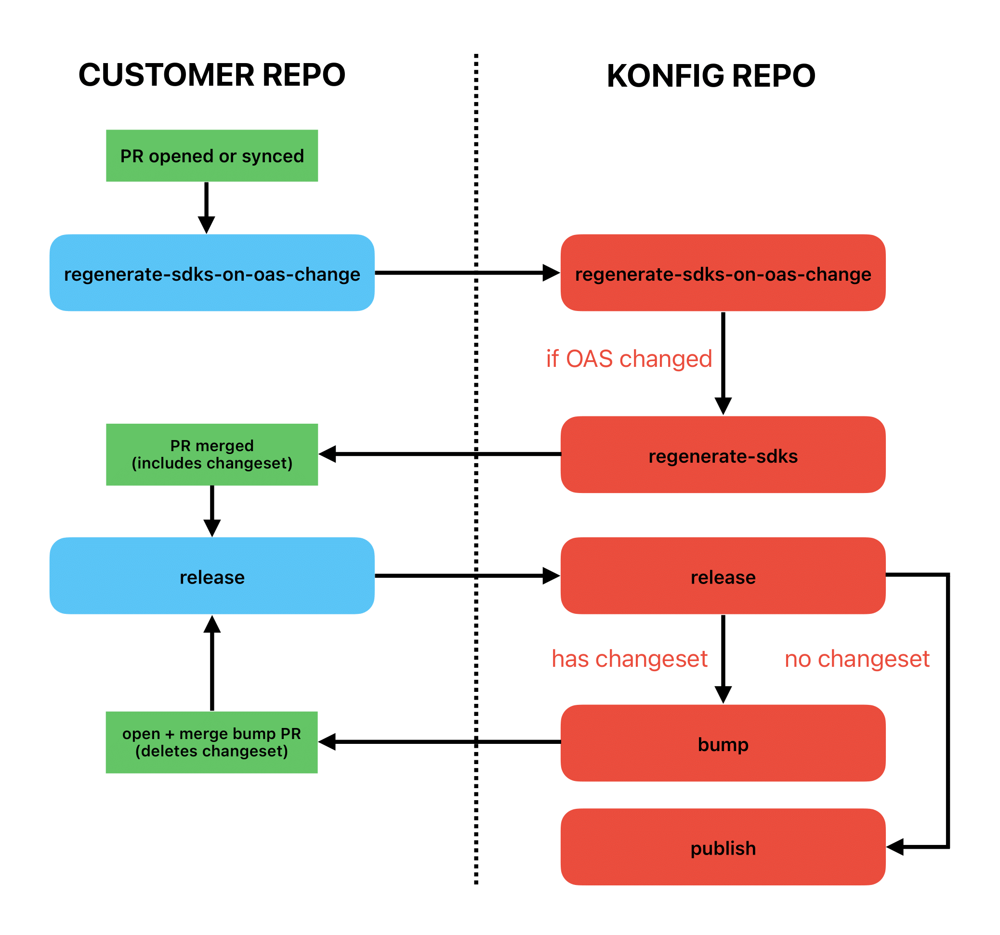

# Konfig Automation

## General Structure

Konfig's automation runs as a series of GitHub actions. The GitHub actions are triggered by events (such as opening a PR or pushing a commit) in a customer's repository. Thus, each customer repository requires 2 GitHub actions worklow files, `regenerate-sdks-on-oas-change` and `release`, to be triggered by the relevant events in their repository.

These workflow files simply perform a "workflow call" to reusable workflows which live in Konfig's automation repository. Konfig uses reusable workflows for DRYness and maintainability. For more information about reusable workflows in GitHub actions, see the documentation [here](https://docs.github.com/en/actions/sharing-automations/reusing-workflows).

### Changesets

You may notice "changeset" or "changeset files" referenced in the above diagram and elsewhere in the context of Konfig's automation. A changeset file is a record of a semver bump type for an SDK or SDKs which has not yet been applied. A changeset file is created when SDKs are regenerated, and are crucial to the control flow of the subsequent workflow, `release`.

`release` checks for the presence of changeset files, and if it finds any, will perform the version bumps as specified by the file(s), then delete the changeset file(s). If `release` finds no changeset files, then there is no version bump to be performed, and the workflow will instead publish the SDKs.

Changeset files can also be manually created during local development by using the CLI command `konfig changeset`, included in the `konfig-cli` npm package. This is typically used when one wants to publish manual changes to an SDK. For example, if a developer wanted to add an additional top-level function to their SDK, they would make the code changes, then run `konfig changeset` before finally pushing or merging to the main branch of the SDK repository. This would trigger the `release` workflow, which, finding a changeset file, would perform the version bump recorded in the changeset file, then publish the new SDK version.

## Workflow Files

Walkthrough the functionality of each of Konfig's workflow files.

### [regenerate-sdks-on-oas-change](https://github.com/konfig-dev/automation/blob/main/.github/workflows/regenerate-sdks-on-oas-change.yaml)

Identifies all konfig.yaml files; then, for each, checks if the corresponding OpenAPI spec was modified. If so, calls the `regenerate-sdks` workflow for that konfig.yaml directory.

This workflow will be called by a workflow in the customer's repository every time a PR is opened targeting the main branch in a customer's SDK repository.

### [regenerate-sdks](https://github.com/konfig-dev/automation/blob/main/.github/workflows/regenerate-sdks.yaml)

First, fixes the OpenAPI spec, then lints it (unless linting is disabled by config). Next, regenerates SDKs and creates a changeset file. Then, pushes these changes to the PR. If there are any SDK submodules, first those will be pushed to a PR created in the corresponding submodule repository.

Next, the regenerated SDKs are tested in a docker container. If they pass, then the PRs are merged. First, any submodule PRs are merged, and the submodule references are updated and pushed to the main PR, if applicable; then, the main repo's PR is merged.

### [release](https://github.com/konfig-dev/automation/blob/main/.github/workflows/release.yaml)

Identifies all konfig.yaml files; then, for each, calls the `bump` workflow and `publish` workflow for that konfig.yaml directory.

This workflow will be called by a workflow in the customer's repository every time a commit is added to the main branch. As explained in the [changesets](#Changesets) section above, the presence of changeset files is essentially used as the control flow to decide whether to route to the `bump` or `publish` workflow next.

### [bump](https://github.com/konfig-dev/automation/blob/main/.github/workflows/bump.yaml)

First checks for a changeset file, and only runs subsequent steps if one is found. If applicable, submodules are synced to make sure everything is up-to-date. Next, the changeset file is deleted and the SDK versions are bumped.

Then, pushes the changes to a bump PR in the main repo. Once again, if there are any SDK submodules, first those will be pushed to a PR created in the corresponding submodule repository with the same branch name.

Finally, unless automatic merging of bump PR is disabled in config, main repo's bump PRs is merged. (Submodule bump PRs have not yet been merged.)

### [publish](https://github.com/konfig-dev/automation/blob/main/.github/workflows/publish.yaml)

First checks for NO changeset files, and only runs subsequent steps if none are found. Next, if applicable, merges submodule bump PRs, then syncs submodules to update the main repo with the newly merged commits. This is all done in the `pre-publish` job.

Then, the SDKs are tested before merging. If the tests pass, then all the necessary setup for publishing to the package managers is performed, followed by the publishing of the SDKs.

An important note: because the `publish` workflow will be run every time a new commit is added to the customer's main branch without a changeset file, Konfig must ensure that no issues arise in case the publish action is run when there is not a new version of one or more SDKs to be published. To do so, the `--tolerateRepublish` flag is used when running the `konfig publish` CLI command, which will log a short warning if an already published version of an SDK is attempted to be published instead of aborting the workflow.

## Setting Up Automation

See [Konfig's documentation on setting up automation for your repository](https://konfigthis.com/docs/tutorials/automate-sdk-updates/).
